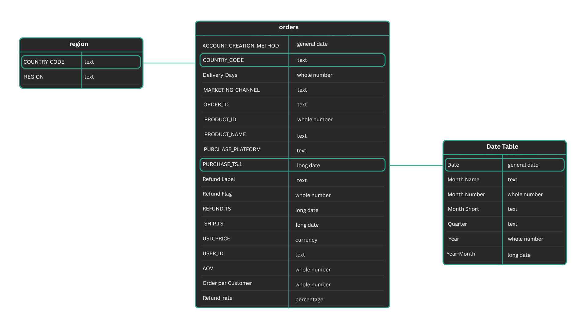

# Project Background

Elcore Electronics is a global e-commerce company operating in the consumer electronics industry, offering a wide range of products including gaming consoles, monitors, laptops, and accessories. The company sells directly to customers through its website and mobile application, following a direct-to-consumer (D2C) business model.

The dataset covers the period from 2019 to 2022, a time during which the company experienced rapid shifts in demand driven by global digital adoption trends and increased consumer interest in home entertainment and gaming products.

  
From a business standpoint, Elcore Electronics focuses on driving revenue growth while maintaining profitability, with key performance metrics including:
- **Total Revenue (USD)** 
-	**Average Order Value (AOV)** 
-	**Orders per Customer** 
-	**Product-Level Revenue Contribution** 
-	**Marketing Channel Performance** 
-	**Regional Sales Distribution** 

This analysis was conducted to support executive leadership and cross-functional teams (Product, Marketing, and Finance) in understanding how revenue has evolved over time and identifying key drivers behind performance trends.

  
The primary business question addressed in this analysis is:

**How did total revenue across all products perform between 2019 and 2022, and what insights can help stakeholders understand high-level trends and opportunities?**

To answer this, the analysis explores multiple dimensions of the business, with insights and recommendations provided across the following key areas:
-	Sales Performance - Identifying top-performing products, revenue concentration, and platform-level trends 
-	Customer Insights - Understanding purchasing behavior, geographic distribution, and customer engagement patterns 
-	Marketing Effectiveness - Evaluating channel performance, revenue contribution, and customer acquisition sources 
-	Operational Efficiency - Analyzing seasonality, revenue fluctuations, and potential inefficiencies in business performance

The interactive PowerBI dashboard can be downloaded [here](https://github.com/haquesparks/Project-1/blob/main/Portfolio%201.pbix).
________________________________________
# Data Structure & Initial Checks

The dataset consists of two primary tables, along with a derived date table created to support time-series analysis, with a total row count of 22,069 records.
-	**Orders Table** 
Contains transactional data including user ID, order ID, product details, pricing, purchase dates, shipping/refund dates, platform, and marketing channel. 
-	**Region Table** 
Maps country codes to their respective geographic regions. 
-	**Date Table** (Derived) 
A custom date dimension table was created to enable robust time-based analysis and reporting. 

### Data Cleaning & Preparation Steps:

Prior to analysis, several data quality checks and transformations were performed using Power Query to ensure accuracy and consistency
-	Removed duplicate order records 
-	Corrected invalid and inconsistent date formats 
-	Removed transactions with zero or invalid pricing 
-	Standardized missing values by replacing them with "Unknown" 
-	Ensured consistency across categorical fields (platform, channel, country) 

The queries utilized to inspect and perform quality checks can be found [here](https://github.com/haquesparks/Project-1/blob/main/Portofolio%201%20Log.xlsx).
________________________________________
# Executive Summary

### Overview of Findings

Between 2019 and 2024, total revenue showed an overall upward trajectory, though with noticeable fluctuations across time. Revenue peaked in 2020, driven by strong demand for high-value electronics products during the pandemic.

A clear seasonal pattern emerged, with revenue consistently spiking in December (holiday demand) followed by sharp declines in January. Additionally, revenue concentration was heavily skewed toward a small number of high-performing products. Though an unusual spike in refund rates was observed in August 2020, highlighting a potential operational disruption that warrants deeper investigation.

At a high level, the business demonstrates strong product-market fit in gaming and high-end electronics, but faces challenges in platform imbalance and product concentration risk.

Below is the Executive Summary page from the PowerBI dashboard and more examples are included throughout the report. The entire interactive dashboard can be downloaded [here](https://github.com/haquesparks/Project-1/blob/main/Portfolio%201.pbix).

________________________________________
# Insights Deep Dive
### Sales Performance
-	Revenue is highly concentrated among a few products, with top contributors including: 
o	27-inch 4K Gaming Monitor 
o	Nintendo Switch 
o	Sony PlayStation 5 Bundle 
o	Lenovo IdeaPad Gaming 3 
-	The 27-inch 4K Gaming Monitor emerged as the top-performing product, generating approximately $1.8M in revenue. 
-	In contrast, certain products significantly underperformed, such as the Razer Pro Gaming Headset, contributing only ~$1K in total revenue, indicating poor product-market fit. 
-	Platform analysis shows that the website significantly outperforms the mobile app, suggesting an imbalance in user experience or adoption. 

________________________________________
### Customer Insights
-	The business is heavily reliant on low-frequency purchasing behavior, with an average of ~1 order per customer, indicating limited repeat purchases. 
-	North America dominates the customer base, contributing the majority of transactions and revenue. 
-	A significant spike in refund rates was observed in August 2020, reaching approximately 30%, compared to a baseline average of ~10% since January 2019, indicating a potential disruption in product quality, fulfillment, or customer expectations during that period.
-	Due to limited available indicators, customer retention trends (new vs returning users) could not be conclusively determined, highlighting a potential gap in tracking customer lifecycle metrics. 

________________________________________
### Marketing Effectiveness
-	The Direct channel is the largest contributor to revenue, suggesting strong brand recognition or repeat visitation. 
-	However, the Affiliate channel generates the highest Average Order Value (AOV), indicating higher-quality or higher-intent traffic. 
-	Account creation is primarily driven through desktop, followed by mobile, aligning with the stronger performance of the website platform. 
-	Further analysis is needed to identify inefficiencies such as high-traffic, low-conversion channels. 

________________________________________
### Operational Efficiency & Trends
-	A strong seasonality effect is observed: 
o	Revenue peaks in December 
o	Sharp declines occur in January, representing a recurring post-holiday slowdown 
-	This indicates potential challenges in: 
o	Demand forecasting 
o	Inventory planning 
o	Revenue stability 

________________________________________
# Recommendations
Based on the analysis, the following strategic actions are recommended:
-	Improve Mobile App Performance
With only ~2.4% of revenue coming from mobile, there is a major opportunity to optimize the mobile experience and increase adoption.   
-	Capitalize on High-Performing Product Categories
Expand inventory and marketing efforts around gaming consoles and high-end electronics, which drive the majority of revenue.  
-	Address Product Portfolio Inefficiencies
Evaluate and potentially discontinue or reposition underperforming products such as the Razer Pro Gaming Headset.  
-	Strengthen Customer Retention Strategies
With low repeat purchase rates, implement loyalty programs, personalized marketing, or email retention campaigns.  
-	Mitigate Seasonal Revenue Volatility
Introduce promotions or campaigns in January to stabilize post-holiday revenue drops.   
- Analyze and Mitigate Refund Rate Anomalies
Investigate the August 2020 refund spike (~30%) to identify whether specific products, regions, or fulfillment issues were responsible, and implement improved quality control and monitoring to prevent recurrence.	
________________________________________
